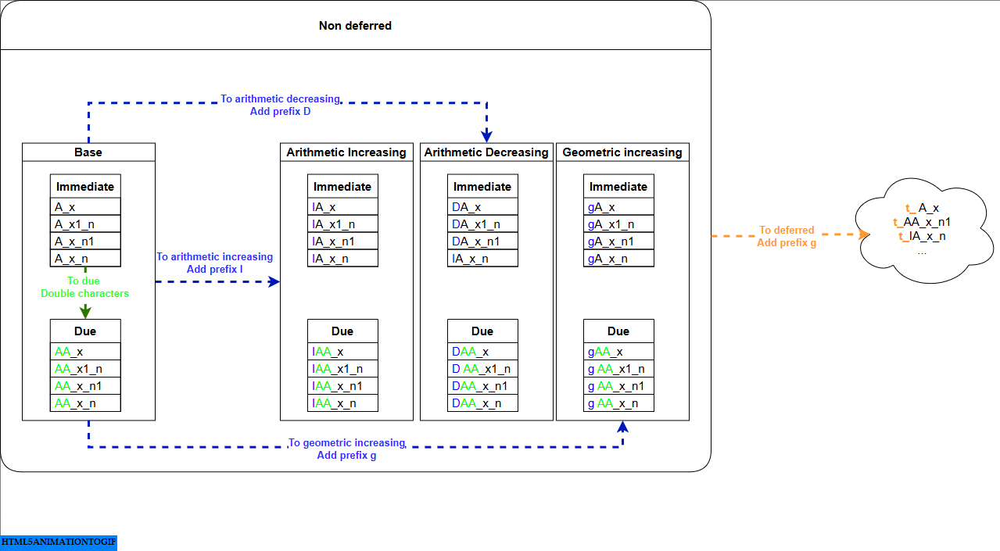

# RSLife

A comprehensive Rust library for actuarial mortality table calculations and life insurance mathematics, following standard actuarial principles and notation.

[](https://crates.io/crates/rslife)
[](https://docs.rs/rslife)
[](https://opensource.org/licenses/MIT)

## Features

- **Performance Optimized**: 4-level detail system automatically optimizes calculations for your needs
- **XML Parsing**: Load mortality data from Society of Actuaries (SOA) XML sources using ACORD XTbML standard
- **Multiple Mortality Assumptions**: UDD, CFM, and HPB methods for fractional age calculations
- **Comprehensive Functions**: Life insurance, annuities, and demographic calculations
- **Standard Notation**: Follows traditional actuarial notation (Ax, äx, etc.)
- **Polars Integration**: Built on Polars DataFrames for efficient data processing
- **Well-Documented**: Extensive documentation with mathematical formulations

## Quick Start

Add this to your `Cargo.toml`:

```toml
[dependencies]
rslife = "0.1.2"
```

### Basic Example

```rust
use rslife::prelude::*;

fn main() -> PolarsResult<()> {
    // Load SOA mortality table
    let xml = MortXML::from_url_id(1704)?;
    let config = MortTableConfig {
        xml,
        radix: Some(100_000),
        int_rate: Some(0.03),
        pct: Some(0.01),
        assumption: AssumptionEnum::UDD
    };

    // Calculate actuarial values
    let whole_life = A_x(&config, 35)?;
    let annuity = aa_x_n(&config, 35, 1)?;
    let survival = tpx(&config, 5.0, 30.0)?;

    println!("Whole life: {:.6}", whole_life);
    println!("Annuity: {:.6}", annuity);
    println!("5yr survival: {:.6}", survival);

    Ok(())
}
```

### Custom Data Example

```rust
use polars::prelude::*;
use rslife::prelude::*;

fn main() -> PolarsResult<()> {
    // Create custom mortality DataFrame
    let df = df! {
        "age" => [30, 31, 32, 33, 34],
        "qx" => [0.001, 0.0012, 0.0015, 0.0018, 0.002],
    }?;

    // Load from DataFrame
    let xml = MortXML::from_df(df)?;
    let config = MortTableConfig {
        xml,
        radix: Some(100_000),
        int_rate: Some(0.05),
        pct: Some(0.01),
        assumption: AssumptionEnum::UDD
    };

    let insurance_value = A_x(&config, 30)?;

    println!("Custom table insurance value: {:.6}", insurance_value);

    Ok(())
}
```

## Performance Optimization

### SOA Mortality Table Automatical Classification

- Only XML files with exactly 1 table are supported.
- The package automatically detects whether `qx` or `lx` is provided and generates a complete mortality table as needed.
- Selection functions automatically detect whether the appropriate SOA mortality table is used for calculation.

### Computation

RSLife automatically optimizes performance with a 4-level detail system:

- **Level 1** (~3x faster): Demographics only (`age`, `qx`, `px`, `lx`, `dx`) - for life table analysis
- **Level 2** (standard): Level 1 + basic commutation (`Cx`, `Dx`) - for most actuarial calculations
- **Level 3** (extended): Level 2 + additional commutation (`Mx`, `Nx`, `Px`) - for some calculations
- **Level 4** (complete): Same as Level 3 + additional `Rx`, `Sx` - reserved for future specialized functions

Functions automatically select the minimum required level for optimal performance.

## Mortality Assumptions

The library supports three standard actuarial assumptions for fractional age calculations:

### UDD (Uniform Distribution of Deaths)

Linear interpolation between integer ages:

```text
ₜpₓ = 1 - t · qₓ
```

### CFM (Constant Force of Mortality)

Exponential survival model:

```text
ₜpₓ = (1 - qₓ)ᵗ
```

### HPB (Hyperbolic/Balmer)

Hyperbolic interpolation:

```text
ₜpₓ = (1 - qₓ) / (1 - (1-t) · qₓ)
```

## Actuarial Functions & Naming Convention

The library provides 88+ actuarial functions following systematic naming patterns based on standard actuarial notation:



### Function Structure

**Base Patterns**:

- `A_x` (insurance)
- `aa_x_n` (annuities)
- `tpx` (survival)

**Systematic Modifiers**:

- **Due**: Double letter → `AA_x`, `aa_x` (payments at start)
- **Increasing**: `I` prefix → `IA_x`, `Iaa_x` (arithmetic growth)
- **Decreasing**: `D` prefix → `DA_x`, `Daa_x` (arithmetic decrease)
- **Geometric**: `g` prefix → `gA_x`, `gaa_x` (geometric growth)
- **Deferred**: `t_` prefix → `t_A_x`, `t_aa_x` (delayed start)
- **Selection**: `_` suffix → `A_x_`, `tpx_` (select mortality tables)

**Examples**:

- `IA_x` (increasing whole life)
- `t_aa_x` (deferred annuity)
- `gIaa_x_n` (geometric increasing term annuity)
- `A_x_` (whole life with selection)

### Selection Functions

All actuarial functions (insurance, annuities, and survival) have corresponding selection variants with a `_` suffix:

- **Insurance**:
  - `A_x_(config, entry_age, x)`,
  - `AA_x_(config, entry_age, x)`,
  - `IA_x_(config, entry_age, x)`,
  - etc.
- **Annuities**:
  - `aa_x_n_(config, entry_age, x, n)`,
  - `Iaa_x_(config, entry_age, x)`,
  - `gaa_x_n_(config, entry_age, x, n)`,
  - etc.
- **Survival**:
  - `tpx_(config, entry_age, t, x)`,
  - `tqx_(config, entry_age, t, x)`
  - etc.

#### Key Differences

- **Additional Parameter**: Selection functions require an `entry_age` parameter in addition to the standard parameters
- **Signature**: `function_(config, entry_age, ...other_params)` vs `function(config, ...params)`
- **Purpose**: Handle select mortality tables where mortality rates depend on both current age and time since policy issue

#### Design Rationale

Selection functions use a separate namespace (with `_` suffix) rather than being integrated into the main functions because:

1. **Rare Usage**: Select mortality tables are encountered infrequently in practice
2. **Explicit Intent**: When selection effects are relevant, it's better to make this explicit through distinct function names
3. **Parameter Clarity**: The additional `entry_age` parameter makes the selection context immediately apparent
4. **API Simplicity**: Keeps the main function signatures clean for the common non-select case

This design choice prioritizes clarity and intentionality over API unification, ensuring that when selection effects matter, developers are explicitly aware of using specialized functionality.

## Examples

Check out the `examples/` directory for more comprehensive examples:

- `prelude_demo.rs` - Basic usage with the prelude
- `mortality_calculations.rs` - Detailed actuarial calculations
- `xml_loading.rs` - Various ways to load mortality data

## Mathematical Documentation

All functions include comprehensive mathematical documentation with Unicode formulas. View the full documentation at [docs.rs/rslife](https://docs.rs/rslife).

**Math Rendering**: The notation in this README and documentation uses Unicode characters for optimal rendering on both GitHub and crates.io, ensuring mathematical formulas display correctly across all platforms without requiring LaTeX rendering support.

## Contributing

Contributions are welcome! Please feel free to submit a Pull Request. For major changes, please open an issue first to discuss what you would like to change.

## License

This project is licensed under the MIT License - see the [LICENSE](LICENSE) file for details.

## Contact

**Trung-Hieu Nguyen** - [hieunt.hello@gmail.com](mailto:hieunt.hello@gmail.com)

Project Link: [https://github.com/hnlearndev/rslife](https://github.com/hnlearndev//rslife)

## References

- [Actuarial Mathematics for Life Contingent Risks](https://www.goodreads.com/book/show/58306503-actuarial-mathematics-for-life-contingent-risks)
- [Actuarial Mathematics](https://www.goodreads.com/book/show/1715653.Actuarial_Mathematics)
- [Society of Actuaries Mortality Tables](https://mort.soa.org)
- Standard actuarial notation and practices

### Similar Projects

**Python:**

- [pyliferisk](https://github.com/franciscogarate/pyliferisk) - Python library for actuarial calculations and life insurance mathematics
- [pymort](https://github.com/actuarialopensource/pymort) - Python mortality table library with XML parsing capabilities

**R:**

- [lifecontingencies](https://github.com/spedygiorgio/lifecontingencies) - R package for actuarial life contingencies calculations
- [MortalityTables](https://github.com/kainhofer/r-mortality-tables) - R package for working with life and pension tables
- [demography](https://github.com/robjhyndman/demography) - R package for demographic analysis and mortality forecasting

**Julia:**

- [MortalityTables.jl](https://github.com/JuliaActuary/MortalityTables.jl) - Julia package for mortality table calculations and life contingencies
- [ActuaryUtilities.jl](https://github.com/JuliaActuary/ActuaryUtilities.jl) - Julia utilities for actuarial modeling and analysis

**Note**:

Mojo is a relatively new language and doesn't yet have established actuarial libraries, but its performance characteristics make it promising for computational actuarial work.
